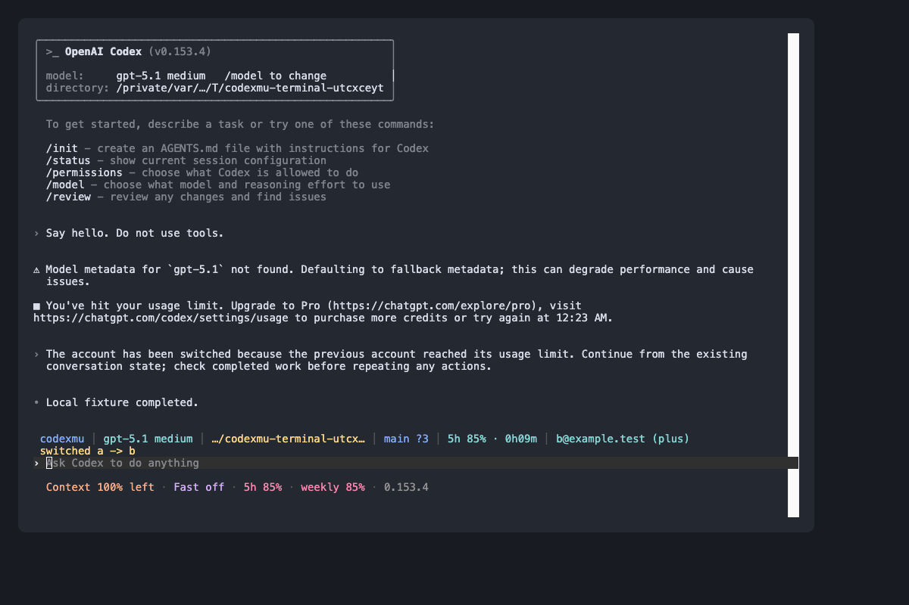

# codexmu

[English](README.md) | **한국어**

Codex의 여러 ChatGPT 계정을 저장하고, 사용 한도에 도달하면 사용 가능한 계정으로 자동 전환하는 Rust 프로그램입니다.

**`codex-auth`, `codext`, Zig가 필요하지 않습니다.** 인증 파일 관리, OAuth 갱신, 사용량 조회, 전환 판단을 Rust에서 직접 처리합니다. 로그인과 터미널·데스크톱 연결에는 **공식 Codex** 실행 파일을 사용합니다. npm 설치는 Node.js를 실행 진입점으로 사용하며, Cargo 설치는 Node.js도 필요하지 않습니다.

## 설치

### npm

Node.js **24 이상**과 공식 Codex가 필요합니다. npm 패키지는 macOS / Linux의 ARM64·x64 실행 파일을 포함하며, 설치 시 Rust 빌드나 별도 바이너리 다운로드를 하지 않습니다.

공개 npm 배포 후에는 다음 명령으로 설치합니다. **현재 저장소에 배포 구성을 추가한 상태이며, 공개 레지스트리 게시 여부는 별도로 확인해야 합니다.**

```sh
npm install -g codexmu
codexmu
```

로컬에서 만든 패키지는 바로 설치할 수 있습니다. 로컬 빌드는 현재 플랫폼용 실행 파일만 포함합니다.

```sh
# 저장소에서 실행; 이 빌드 단계에는 Rust 필요
npm run build
mkdir -p dist
npm pack --pack-destination dist
npm install -g ./dist/codexmu-0.1.0.tgz
codexmu --version
```

기존 Cargo 설치가 있다면 `command -v codexmu`로 PATH에서 어떤 설치가 선택되는지 확인하세요.

### Cargo

Rust 1.89 이상과 공식 Codex가 필요합니다. 터미널 모드는 macOS / Linux, 데스크톱 앱 실행은 macOS에서 지원합니다. 공식 Codex는 `--remote unix://...`를 지원해야 하며, 기존 검증 버전은 CLI 0.153.4입니다.

소스를 내려받은 프로젝트 디렉터리에서 실행하세요.

```sh
cargo install --path . --locked
codexmu --help
```

Cargo가 PATH에 없다면 먼저 `source "$HOME/.cargo/env"`를 실행하세요. 설치 없이 `cargo build --release` 후 `./target/release/codexmu`를 실행해도 됩니다.

## 계정 등록과 실행

**계정은 2개, 3개 이상 등록할 수 있으며 프로그램에 개수 제한은 없습니다.** 현재 Codex에 로그인된 계정을 저장하고, 추가 계정마다 다른 이름으로 로그인하세요.

```sh
codexmu add personal
codexmu login work --device-auth
codexmu login extra --device-auth
codexmu switch personal
codexmu list --live
codexmu
```

등록된 모든 계정이 자동 전환 후보가 됩니다. 예를 들어 `personal`과 `work`가 차례로 한도에 걸리면 사용 가능한 `extra`로 전환해 같은 대화를 이어갑니다. 전환 순서는 등록 순서가 아니라 남은 사용량에 따라 결정합니다.

`login`은 임시 `CODEX_HOME`에서 공식 `codex login`을 실행합니다. 로그인 취소·실패 시 기존 활성 계정은 그대로 유지됩니다. 브라우저 로그인을 쓰려면 `--device-auth`를 생략하세요. 키체인에만 저장되어 `auth.json`이 없다면 `add` 대신 `login`을 사용하세요.

이미 저장한 **표준 Codex auth.json**도 가져올 수 있습니다.

```sh
codexmu add work --auth-file /path/to/work-auth.json
codexmu remove unused
```

같은 계정의 중복 등록, 이름 덮어쓰기, 활성 계정 삭제는 거부합니다. 계정 이름은 영문·숫자·`-`·`_`로 1~64자입니다. API 키 계정은 자동 과금 전환을 하지 않도록 지원 대상에서 제외했습니다.

## Codex 터미널 — macOS / Linux

계정을 등록한 뒤 **`codexmu`만 실행하면 공식 Codex 터미널 화면으로 바로 들어갑니다.** 한도 오류가 발생하면 다른 등록 계정으로 전환하고 같은 대화에서 작업을 자동으로 이어갑니다.

`codext`의 미리보기처럼 입력창 바로 위에 색상 상태 헤더를 표시합니다.



위 이미지는 로컬 가짜 계정으로 검증한 실제 PTY 출력을 터미널 에뮬레이터에서 재생한 모습입니다.

```text
codexmu │ gpt-5.1 medium │ …/codexmu │ main +2 │ 5h 85% · 0h42m │ user@example.com (plus)

› 프로젝트를 설명해 줘
  Context 100% left · Fast off · 5h 85% · weekly 58% · 0.153.4
```

표시되는 값은 현재 세션의 모델·추론 강도·작업 경로, Git 브랜치와 변경 수, 실제 조회한 남은 사용량, 활성 계정의 이메일·플랜입니다. 헤더의 시간은 한도 초기화까지 남은 시간입니다. 계정 전환이 서버에서 승인되면 헤더도 새 계정으로 바뀌고 전환 알림을 잠시 표시합니다. 조회되지 않은 한도는 `—`로 표시하며, 좁은 창에서는 경로·Git 표시를 줄입니다. 배경·글꼴은 사용하는 터미널 설정을 따릅니다.

```sh
codexmu
codexmu "이 프로젝트를 설명해 줘"
codexmu run -- --model gpt-5.1
codexmu run -- resume --last

# 상태 헤더 없이 원래 공식 Codex 화면 사용
codexmu --plain
```

**같은 `CODEX_HOME`에서 여러 `codexmu` 창을 동시에 실행할 수 있습니다.** 각 터미널에서 `codexmu`를 실행하면 됩니다. 계정 목록과 기본 활성 계정은 공유하고, 대화·승인·실행 중인 인증은 각 창의 공식 Codex 서버가 관리합니다. 다른 창에서 계정이 바뀌면 각 창은 실행 중인 턴이 끝난 뒤 사용량 확인 시 새 계정을 적용합니다. 한도 오류가 난 창은 바로 전환을 시도합니다.

계정 저장소 접근·사용량 조회·OAuth 갱신은 저장소 잠금으로 직렬화합니다. 여러 창이 같은 토큰을 갱신하려고 하면 먼저 갱신된 토큰을 재사용하며, 다른 계정으로 작업 중인 창의 인증을 덮어쓰지 않습니다. 잠금은 세션 전체를 점유하지 않습니다.

새 홈에서 공식 Codex의 SQLite 초기화가 충돌하지 않도록 서버 시작부터 초기화 응답까지는 별도 시작 잠금으로 순서를 맞춥니다. 초기화 응답을 받으면 즉시 해제하여 여러 세션이 함께 작업할 수 있습니다.

공식 Codex의 `--remote unix://...` 기능을 이용합니다. 이 기능을 지원하는 Codex가 필요하며 CLI 0.153.4에서 검증했습니다. 임시 전용 Unix 소켓으로 기존 터미널 UI와 인증 전환 브리지를 연결하고, PTY 화면에 상태 헤더를 합성합니다. 종료 시 소켓을 제거하고 터미널 설정을 복구합니다. TCP 포트를 열지 않습니다. 긴 대화는 공식 Codex의 `Ctrl+T` 화면에서 확인할 수 있습니다. 터미널 고유의 키보드·스크롤 동작이 필요하면 `--plain`을 사용하세요.

Codex 옵션은 `run --` 뒤에 전달하면 관리 명령·옵션과 혼동하지 않습니다. `--remote` 연결 주소는 codexmu가 관리합니다. 자동 재개를 끄려면 `codexmu --no-resume`을 실행하세요.

## Codex 데스크톱 앱 — macOS

**실행 중인 Codex 앱을 종료한 다음** 실행하세요.

```sh
codexmu app
```

공식 CLI 경로를 지정하려면:

```sh
codexmu --codex-bin /absolute/path/to/codex app
```

`app`은 macOS `open --env`로 `CODEX_CLI_PATH`를 이 바이너리로 설정합니다. 앱이 시작한 `codexmu`는 공식 `codex app-server`와 앱 사이에서 JSON-RPC를 전달합니다. 앱 설치 파일이나 전역 설정을 수정하지 않습니다. 이미 실행 중인 앱에는 환경변수가 적용되지 않으므로 실행을 거부하고 종료 후 재실행을 안내합니다.

터미널과 데스크톱은 같은 전환 동작을 사용합니다.

- 기본 60초마다 **턴이 실행 중이지 않을 때** 사용량을 조회합니다.
- `usageLimitExceeded`로 턴이 끝나면 다음 주기를 기다리지 않고 다른 계정을 찾습니다.
- 사용 가능한 계정 중 응답에 포함된 사용량 창의 최대 사용률이 가장 낮은 계정을 선택합니다.
- 새 인증은 `account/login/start`로 실행 중인 공식 app-server에 전달합니다. 파일만 교체하고 끝내지 않습니다.
- 기본적으로 같은 스레드에 계속 진행하라는 새 턴을 보냅니다. 원래 프롬프트나 실행한 도구 호출을 재전송하지 않습니다.
- 다른 턴이 실행 중이면 전환을 미룹니다. 전환 중 들어온 새 턴은 잠시 대기하고, 승인 응답은 계속 전달합니다. 취소된 대기 턴은 실행하지 않습니다.

자동 재개 없이 계정만 전환하려면:

```sh
codexmu --no-resume app
```

같은 실패의 자동 복구는 계정별 한 번으로 제한합니다. 전체 계정이 소진되면 재시도 루프를 만들지 않고 사용량 감시를 계속합니다. 이후 계정이 복구되면 다시 계속 진행하라고 입력할 수 있습니다. 일반 네트워크 오류, 서버 과부하, 모델 출력에 포함된 “limit” 문자열만으로 계정을 바꾸지 않습니다.

## 독립 감시와 다른 클라이언트 연결

```sh
# 한 번 판단하기 / 전환 계획만 확인하기
codexmu watch --once
codexmu watch --once --dry-run

# 주기적으로 auth.json 전환하기
codexmu --interval 30 watch

# JSON-RPC stdio 클라이언트에서 실행할 서버
codexmu app-server
codexmu app-server -- --stdio
```

`watch`는 파일을 관리하는 모드입니다. **별도로 실행한 일반 `codex`의 메모리상 인증을 강제로 바꾸지는 않습니다.** 실행 중에 자동 전환하려면 `codexmu`, `codexmu app` 또는 `codexmu app-server` 연결을 사용하세요.

`app-server` 명령은 stdio 연결만 지원하며 `--listen`을 받지 않습니다. 기본 터미널 모드에서는 세션별 전용 Unix 소켓을 내부적으로 사용합니다. 터미널과 브리지는 여러 개 실행할 수 있으며 독립 `watch` 프로세스만 홈별 하나로 제한합니다. 연결 중 UI 내 로그인·로그아웃 대신 `codexmu login/add/switch`를 사용합니다.

`codexmu`를 실행할 때는 별도의 `codexmu watch`가 필요하지 않습니다. 중복 `watch`를 실행하면 점유 프로세스의 PID를 오류에 표시합니다. 프로세스 종료 시 운영체제가 잠금을 해제하므로 잠금 파일을 삭제할 필요는 없습니다.

## 저장 위치와 설정

```text
$CODEX_HOME/auth.json                       활성 Codex 인증
$CODEX_HOME/codexmu/accounts/<name>.json     계정별 인증·일시 제외 시각
$CODEX_HOME/codexmu/previous-auth.json       직전 활성 인증 백업
$CODEX_HOME/codexmu/pending-refresh.json     중단된 OAuth 갱신 복구용 임시 기록
$CODEX_HOME/codexmu/terminal-<PID>.log       세션별 공식 서버 진단 로그
```

`CODEX_HOME` 기본값은 `~/.codex`입니다. 별도 계정 저장 공간이 필요하면 `--codex-home /path`를 사용하세요. 로그인 토큰은 로컬 JSON에 저장하며 암호화하지 않습니다. Unix에서는 관리 디렉터리를 `0700`, 인증 파일을 `0600`으로 생성하고 원자적으로 교체합니다. `list`에는 토큰을 출력하지 않습니다. 갱신은 잠금과 복구 기록으로 보호하고, 외부 Codex가 갱신한 활성 토큰도 전환 전에 보존합니다.

| 설정 | 환경변수 | 기본값 |
| --- | --- | --- |
| `--codex-home` | `CODEX_HOME` | `~/.codex` |
| `--codex-bin` | `CODEXMU_CODEX_BIN` | `codex` |
| `--interval` | `CODEXMU_INTERVAL` | 60초, 최소 5초 |
| `--no-resume` | `CODEXMU_NO_RESUME` | false |

사용량 요청 실패·유효한 사용량 창이 없는 응답·이미 지난 리셋 시각을 여유 계정의 증거로 사용하지 않습니다. 한도에 도달한 계정은 최소 60초 동안 후보에서 제외됩니다. `--dry-run`은 계정 전환을 하지 않지만 정상 인증 유지에 필요한 OAuth 갱신은 할 수 있습니다.

## 검증

```sh
npm test
cargo fmt --check
cargo clippy --all-targets -- -D warnings
cargo test
cargo build
python3 tests/check.py

# 공식 Codex에 실제 인증 변경 RPC까지 검증 (테스트용 가짜 토큰 사용)
python3 tests/check.py --native "$(command -v codex)"

# 실제 공식 Codex 터미널: 입력 → A 한도 → B 응답 → /quit → 터미널 복구
python3 tests/terminal.py --codex-bin "$(command -v codex)" --resize
python3 tests/terminal.py --codex-bin "$(command -v codex)" --plain
python3 tests/terminal.py --codex-bin "$(command -v codex)" --sessions 3 --resize
```

테스트는 임시 홈과 로컬 HTTP 서버를 사용합니다. 개인 인증 파일을 읽거나 실제 한도를 소진하지 않습니다. HTTP 오류·401 갱신·전체 소진·중복 계정·원자적 저장·갱신 복구·RPC ID 충돌·한도 후 같은 스레드 재개·승인 전달·일반 오류·종료 동작을 검사합니다. `--native`는 공식 Codex가 HTTP 429를 받은 뒤 **같은 스레드의 후속 모델 요청에 B 계정의 토큰을 사용하고 정상 완료하는 것**과 `account/read`의 계정 변경을 확인합니다.

기존 검증 환경은 macOS ARM64 / 공식 Codex CLI 0.153.4이며 빌드·프로토콜·실제 터미널 PTY 테스트를 포함합니다. 데스크톱 GUI의 전체 실행과 실제 계정의 한도 소진은 검증 범위에 포함되지 않습니다. `chatgptAuthTokens`는 실험적 프로토콜이고 사용량 엔드포인트도 공개 안정 API가 아니므로, Codex 변경 시 호환성 확인이 필요합니다.

## 기여

코드 구조, 인증·동시 실행 시 지켜야 할 조건, 변경별 검증 방법은 [AGENTS.md](AGENTS.md)를 참고하세요. 동작이나 명령을 변경하면 영문·한글 README를 함께 갱신하세요.

## npm 배포

`package.json`과 `Cargo.toml`의 버전을 함께 변경하세요. GitHub 저장소에 코드를 올린 뒤 Actions의 **npm release → Run workflow**를 실행하면 네 플랫폼의 바이너리를 빌드·검증하고 `npm-package` 아티팩트에 설치 가능한 `.tgz`를 만듭니다. Linux는 musl 타깃으로 빌드합니다.

공개 게시하려면 해당 npm 패키지에 게시 권한이 있는 토큰을 저장소의 Actions secret **`NPM_TOKEN`**에 등록하고, 워크플로의 **publish**를 선택하세요. 패키지 이름을 바꾸려면 `package.json`의 `name`을 변경하면 됩니다. 워크플로는 네 플랫폼의 빌드와 검증이 모두 성공한 뒤 패키지를 게시합니다.

로컬 `npm publish`도 네 플랫폼 실행 파일이 모두 있는지 먼저 확인합니다. `npm pack`은 현재 플랫폼만으로 허용하므로 로컬 설치 테스트에 사용할 수 있습니다. 이 로컬 전용 `.tgz`를 공개 게시하지 마세요. 의존 npm 패키지와 설치 스크립트는 없습니다.

## 참고한 프로젝트

- [Loongphy/codex-auth](https://github.com/Loongphy/codex-auth/tree/0fde29598c2e02e28e0e8bcc33a4bb8d45d7b23a): 인증 파일 구조와 사용량 조회 방식 참고.
- [Loongphy/codext](https://github.com/Loongphy/codext/tree/50990b9913fd8f66456d9838dbeee572c6f10fc1): 안전한 턴 경계에서 인증 변경과 한도 오류 후 재개 방식 참고.
- [공식 Codex App Server 문서](https://developers.openai.com/codex/app-server): JSON-RPC 초기화·턴·계정 프로토콜 참고.

두 프로젝트의 바이너리·소스·패키지를 다운로드하거나 호출하는 런타임 코드는 없습니다.

## 라이선스

[MIT](LICENSE)
